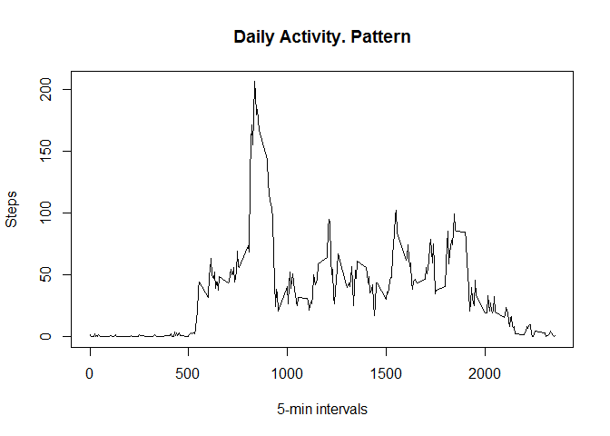

# Reproducible Research: Peer Assessment 1
## Notes

It's assumed that *knitr* package is already loaded, this assesment was performed with RStudio Version 0.98.1103 using the Knit integration.

## Loading and preprocessing the data

The data file 'activity' comes in a zip format, the following code will unzip it in the working directory.


```r
unzip("activity.zip", exdir=".", overwrite=TRUE)
```

The following code will load the data from the .csv file.


```r
data <- read.csv("activity.csv")
```

## What is mean total number of steps taken per day?

After load the data, it's needed to summarize the total numbers of steps per day, there's a lot of ways you can summarize the data, my favorite one is the way provided by the package dplyr, so make sure to have it installed, if not just simply install typing 'install.packages("dplyr")'.

According to the assigment, it can be ignored the missing values in the data set and was asked to make a histogram of the total number of steps taken each day. 


```r
library(dplyr)
stepsPerDay <- summarize(group_by(na.omit(data), date), total = sum(steps))
hist(stepsPerDay$total, main="Frequency of total steps in a day", xlab="Steps per Day", ylab="Frequency in Days")
```

 

Calculating and report the mean and median total number of steps taken per day.

```r
meanSteps <- mean(stepsPerDay$total, na.rm=TRUE)
medianSteps <- median(stepsPerDay$total, na.rm=TRUE)
```


The mean is **10766.189** and the median is **10765**.

## What is the average daily activity pattern?

Making a time series plot.

```r
avgDailyPattern <- summarize(group_by(na.omit(data), interval), avgSteps = mean(steps))
plot(avgDailyPattern$interval, avgDailyPattern$avgSteps, type="l", main="Daily Activity. Pattern", xlab="5-min intervals", ylab="Steps")
```

 
  
Which 5-minute interval, on average across all the days in the dataset, contains the maximum number of steps?  
According to the time plot the 5 min. interval is close to the 1000 intelval, let's figure it with the following R code:

```r
maxAvgSteps <- max(avgDailyPattern$avgSteps);
maxAvgStepsInterval <- avgDailyPattern$interval[avgDailyPattern$avgSteps == maxAvgSteps]
```

The 5-minute interval, on average across all the days in the dataset, which contains the maximum number of steps is the: **835** with **206.1698113** steps.

## Imputing missing values

It's needed to calculate and report the total number of missing values in the dataset (i.e. the total number of rows with  NA s), we'll use nrow and the complete.cases function to do it, which is going to return a logical vector.


```r
naRowCount <- nrow(data[!complete.cases(data),])
```
There're **2304** rows with NA values.  

It's required to fill in all of the missing values in the dataset, so a good alternative would be use the mean, as the suggestion in the asssement description, using the sapply function provided by the base package.  

Create a copy of the original dataset and create a dataset which contains the average steps per each interval on the rows without NA values.


```r
avgIntervalSteps <- summarize(group_by(na.omit(data), interval), avgSteps = mean(steps))
```

Now is a matter to copy the original on the new one and locate each interval with NA steps and replacing those for the averages of the rest of the valid rows


```r
newData <- data

for(i in 1:nrow(newData))
{  
  if(is.na(newData[i,1]))
  {
    newData[i,1] <- avgIntervalSteps$avgSteps[avgIntervalSteps$interval == newData[i,3]]
  }
}
```

Making a histogram of the total number of steps taken each day and calculatuing and report the mean and median total number of steps taken per day. Do these values differ from the estimates from the first part of the assignment? What is the impact of imputing missing data on the estimates of the total daily number of steps?  


```r
newStepsPerDay <- summarize(group_by(na.omit(newData), date), total = sum(steps))
hist(newStepsPerDay$total, main="New Frequency of total steps in a day", xlab="Steps per Day", ylab="Frequency in Days")
```

 

Calculating the new mean and the median


```r
newMeanSteps <- mean(newStepsPerDay$total)
newMedianSteps <- median(newStepsPerDay$total)
```


The new mean is **10766.189**, and the new median is **10766.189**.

So, addressing the question, the impact is a little change in the median because the mean was used to fill the values, if the median will be used, then the impact should be located in the mean.

## Are there differences in activity patterns between weekdays and weekends?

It will be used the last dataset to answer this question, also the funcion 'weekdays' is going to be used.

Creating a new factor variable in the dataset with two levels -- "weekday" and "weekend" indicating whether a given date is a weekday or weekend day. To do that is necesary to change the format of the date field from text to date.


```r
newData$date <- as.Date(newData$date, "%Y-%m-%d")
#the var day is created containing "weekday" in all rows
newData$day <- "weekday"
#the function weekdays allow to identify the day name, so when the day us Sat or Sun the value is replaced by weekend.
newData$day[weekdays(newData$date) %in% c("Saturday","Sunday")] <- "weekend"
#the new column variable is set as a factor.
newData$day <- as.factor(newData$day)
```

Making a time series plot using lattice as is in the assessment description.


```r
avgWeekDayPattern <- aggregate(newData$steps, by = list(newData$interval, newData$day), mean)
names(avgWeekDayPattern) <- c("interval", "day", "steps")
library(lattice)
xyplot(steps ~ interval | day, avgWeekDayPattern, type = "l", layout = c(1, 
    2), xlab = "Interval", ylab = "Steps", main = "Activity Patterns on Weekends and Weekdays")
```

 

Answering the question, Yes, there are differences, in the weekends the average of steps tends to start late, around the 700-ish interval, in the weekday is just around the 500-ish interval, and the maximum peak is near to the 800-ish interval, for both "weekends and weekdays", the activity the weekdays is more steady, and it seems in the weekends the people tend to be more active and walk more.   
